:title: Ace Exam
:author: Bas Rustenburg
:description: Admission to candidacy exam
:keywords: exam, ace, phd
:css: ace.css

.. |lt_variance| image:: images/colored_variance.png

:data-transition-duration: 1

----

:id: title

Admission to candidacy exam
===========================

Bas Rustenburg
--------------

Date : 5/29
...........

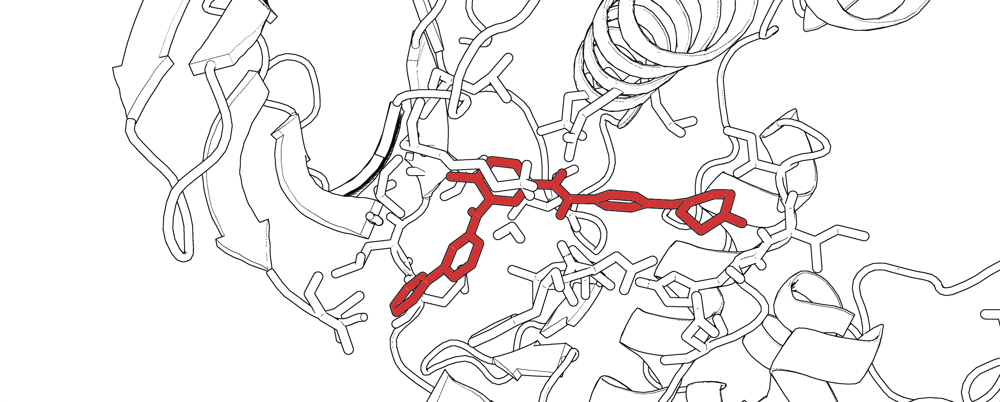

----

The efficiency of the pharmaceutical industry has been declining for years
==========================================================================

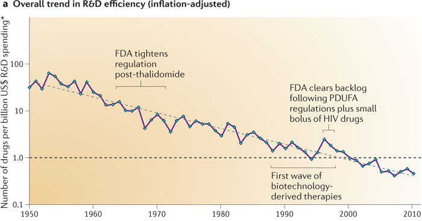
  
  Kack W. Scannell et al. *Nature Reviews Drug Discovery* 11, 191-200 (2012)

----

It takes up to 4 million dollars, just to find a molecule that binds a target!
==============================================================================

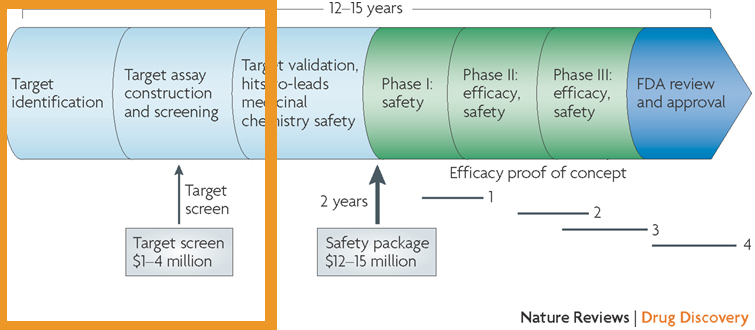
  
  Allen D. Roses  *Nature Reviews Drug Discovery* 7, 807-817 (2008)

  Each consecutive step only gets more expensive!

----

There is a clear need for a cheaper strategy
============================================

Computational approaches offer a cheap solution
-----------------------------------------------

* They benefit from Moore's law, with increased computational efficiency each year

* Allows for a *fail fast, fail cheaply* methodology for designing drugs
    * Drugs that do not bind the intended target can fail earlier, without a huge R&D investment

* Ability to study hypothetical small molecules

.. note::
  For instance,
  * compounds that have not been synthesized.
  * when protein is expensive.
  * When you cant reach concentrations of poorly soluble drugs.

----

It is all about the binding affinity
====================================

A strong binder maximizes the ratio of complex concentration (**[PL]**) over free protein (**[P]**) and ligand (**[L]**).

This is known as the association constant (**Ka**).

+-------------------------------------+
| .. image:: images/colored_PL.png    |
|   :width: 300px                     |
+-------------------------------------+
| .. image:: images/colored_Ka_Kd.png |
|   :width: 600px                     |
+-------------------------------------+

----

It is all about the binding affinity
====================================

A strong binder minimizes the ratio of free protein (**[P]**) and ligand (**[L]**) over complex concentration (**[PL]**).

This is known as the dissociation constant (**Kd**), often used synonymously with the binding affinity.

+-------------------------------------+
| .. image:: images/colored_PL.png    |
|   :width: 300px                     |
+-------------------------------------+
| .. image:: images/colored_Kd_Ka.png |
|   :width: 600px                     |
+-------------------------------------+

----

It is all about the binding affinity
====================================

A strong binder minimizes the ratio of free protein (**[P]**) and ligand (**[L]**) over complex concentration (**[PL]**).

This is known as the dissociation constant (**Kd**), often used synonymously with the binding affinity.

This can be related to the free energy of binding, **ΔG**.

+-------------------------------------+
| .. image:: images/colored_PL.png    |
|   :width: 300px                     |
+-------------------------------------+
| .. image:: images/colored_Kd_Ka.png |
|   :width: 600px                     |
+-------------------------------------+
| .. image:: images/colored_Kd.png    |
|   :width: 500px                     |
+-------------------------------------+

----

:id: docking

Molecular docking for affinity estimation
=========================================

+----------------------------------------------+------------------------------------------------------------+
| .. figure:: images/docking.gif               | .. figure:: images/scoring.jpg                             |
|   :width: 300px                              |   :width: 400px                                            |
|                                              |                                                            |
|   Molecule is inserted into a rigid receptor |   Free energy is estimated by some arbitrary scoring terms |
+----------------------------------------------+------------------------------------------------------------+

----

Docking does not provide accurate estimates
===========================================

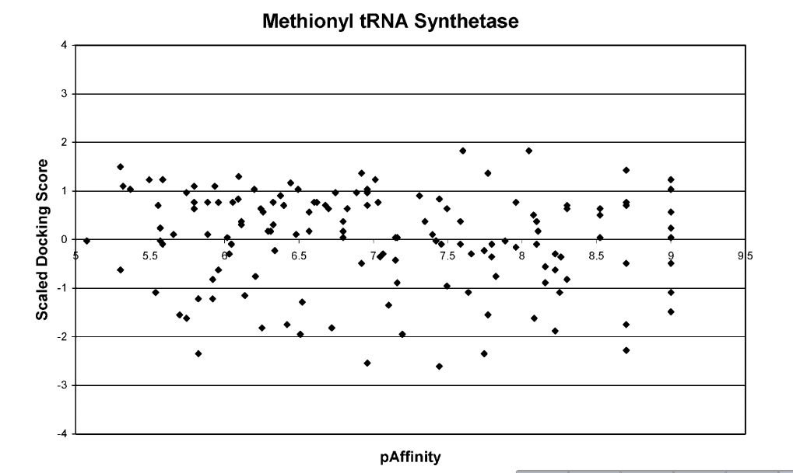
  
  *For prediction of compound affinity, none of the docking programs or scoring functions made
  a useful prediction of ligand binding affinity.*
  
  Warren et al. *J Med Chem* 49 (20), pp 5912–5931 (2006)

----

:id: deshaw

If your name is DE Shaw
=======================

You can simulate binding events from microsecond timescale MD simulations
-------------------------------------------------------------------------

.. image:: images/deshaw2.gif

For typical drug off-rates (1/10 000 seconds), trajectories would need to be impractically long (hours), requiring ~100 million CPU-years to simulate.

----

:id: alchemical

Alchemical free energy calculations
===================================

Why?
----

They allow efficient sampling of the relevant states of protein-ligand complexes.

.. image:: images/colored_PL.png
  :width: 300px

www.alchemistry.org

----

Alchemical free energy calculations
===================================

(in principle) allow for us to calculate affinities indirectly.
---------------------------------------------------------------

+------------------------------------------------+
| .. image:: images/colored_Kd.png               |
|   :width: 300px                                |
+------------------------------------------------+
| .. image:: images/alchemical_intermediates.png |
|   :width: 750px                                |
+------------------------------------------------+

Chodera, JD et al. *Curr Opin Struct Biol*, 21:150 (2011)

----

Alchemical free energy calculations
===================================

Alchemical methods allow for phase space overlap
------------------------------------------------

+--------------------------------------+--------------------------------------+
| .. figure:: images/normal_states.png | .. figure:: images/alchem_states.png |
|   :width: 370px                      |   :width: 370px                      |
+--------------------------------------+--------------------------------------+
| .. figure:: images/colored_zwanzig.png                                      |
|   :width: 400px                                                             |
+-----------------------------------------------------------------------------+

Wu, D and Kofke, DA *J Chem Phys* 123: 054103 (2005).

Zwanzig, RW, *J Chem Phys* 22, 1420 (1954)

.. note::
  You can interpret the equation as follows. We sample from state A, but use this to sample state B.
  To unbias the samples, we remove a factor of exp(-beta U_A), and reweight by adding a factor of exp(-beta U_B).
  If you sample A, the states might correspond to mostly high energy states in b, where the exponent of -U_B is very small,
  meaning little contribution to the free energy. Therefore, your estimate converges very slowly.

----

Alchemical free energy calculations
===================================

There are deficiencies that need to be addressed before alchemical free energy calculations can be applied widely.

----

:id: spec-aims

Alchemical free energy calculations
===================================

There are deficiencies that need to be addressed before alchemical free energy calculations can be applied widely.

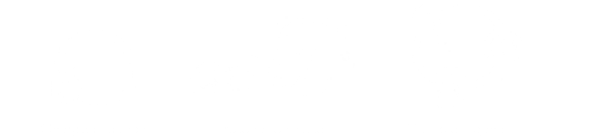

----

Alchemical free energy calculations
===================================

There are deficiencies that need to be addressed before alchemical free energy calculations can be applied widely.

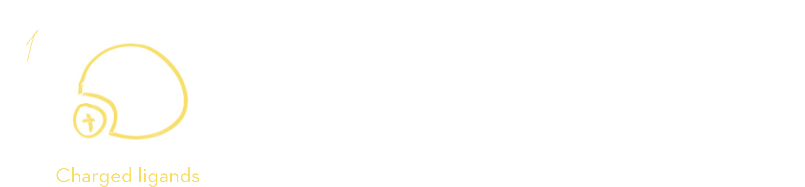

----

Charged ligands include
=======================

+-----------------------------------+-----------------------------------+
| .. figure:: images/saquinavir.png | .. figure:: images/nelfinavir.png |
|   :height: 200px                  |   :height: 400px                  |
|                                   |                                   |
|   Saquinavir                      |   Nelfinavir                      |
+-----------------------------------+                                   +
| .. figure:: images/indinavir.png  |                                   |
|   :height: 200px                  |                                   |
|                                   |                                   |
|   Indinavir                       |                                   |
+-----------------------------------+-----------------------------------+

Protease inhibitors typically have positive charges. Here are three FDA approved *HIV-protease inhibitors*.

(image source: www.chemicalize.org)

----

Charged ligands include
=======================

+--------------------------------+----------------------------------+
| .. figure:: images/aspirin.png | .. figure:: images/ibuprofen.png |
|   :height: 350px               |   :height: 350px                 |
|                                |                                  |
|   Aspirin                      | Ibuprofen                        |
+--------------------------------+----------------------------------+
  
Many over-the-counter *nonsteroidal anti-inflammatory drugs* have charged moieties!

(image source: www.chemicalize.org)

----

Charged ligands include
=======================

Anti-histamines
---------------

+--------------------------------------------------------------------------------+
| .. figure:: images/histamine.png                                               |
|   :width: 200px                                                                |
|                                                                                |
|   Histamine                                                                    |
+--------------------------------------------------------------------------------+

(image source: www.chemicalize.org)

----

Charged ligands include
=======================

Anti-histamines
---------------

+-----------------------------------------+--------------------------------------+
| .. figure:: images/diphenhydramine.png  | .. figure:: images/clemastine.png    |
|   :width: 250px                         |   :width: 200px                      |
|                                         |                                      |
|   Benadryl (diphenhydramine)            |   Tavist (clemastine)                |
+-----------------------------------------+--------------------------------------+
| .. figure:: images/azelastine.png       | .. figure:: images/hydroxyzine.png   |
|   :width: 200px                         |   :width: 350px                      |
|                                         |                                      |
|   Astelin (azelastine)                  |   Atarax (hydroxyzine)               |
+-----------------------------------------+--------------------------------------+

(image source: www.chemicalize.org)

----

Alchemical free energy calculations
===================================

There are deficiencies that need to be addressed before alchemical free energy calculations can be applied widely.

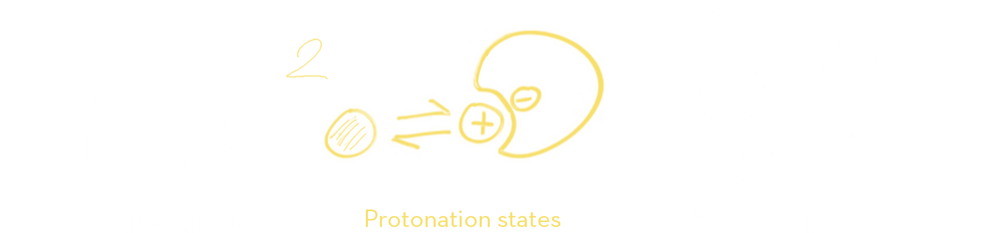

----

Protonation states may vary for kinase inhibitors
=================================================

EGFR inhibitors lapatinib and gefitinib
---------------------------------------

+----------------------------------+----------------------------------+
| .. figure:: images/lapatinib.png | .. figure:: images/gefitinib.png |
|   :width: 300px                  |   :width: 300px                  |
|                                  |                                  |
|   Lapatinib                      |   Gefitinib                      |
+----------------------------------+----------------------------------+

Many FDA approved kinase inhibitors have titratable moieties with pKas near 7.

(image source: www.chemicalize.org)

.. note::

  These two drugs are EGFR/Her2 inhibitors, important in lung and breast cancers
  (Non small cell lung cancer)
  
----

Protonation states may vary for kinase inhibitors
=================================================

Imatinib, a potent inhibitor of Abl kinase
------------------------------------------

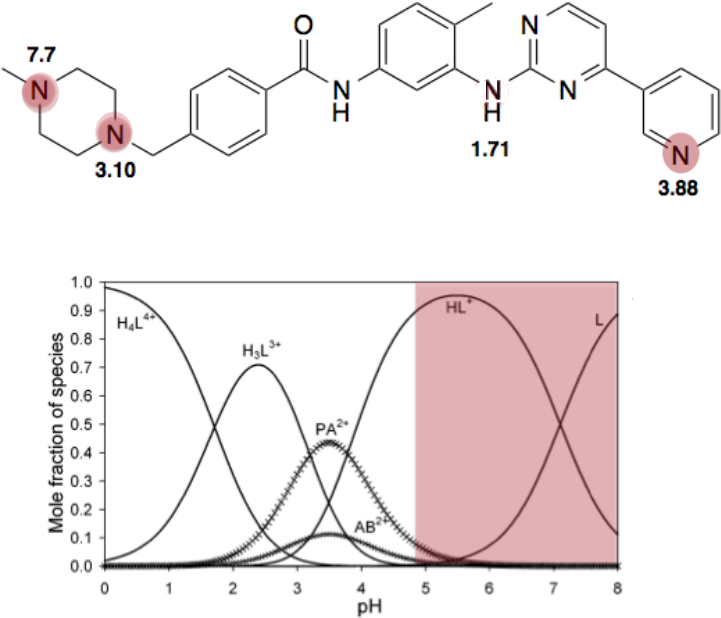

Szakács, Z. et al. *J Med Chem* 2005, 48, 249–255

.. note::
  Do not forget to mention that the protonated form of these inhibitors is charged

----

Alchemical free energy calculations
===================================

There are deficiencies that need to be addressed before alchemical free energy calculations can be applied widely.

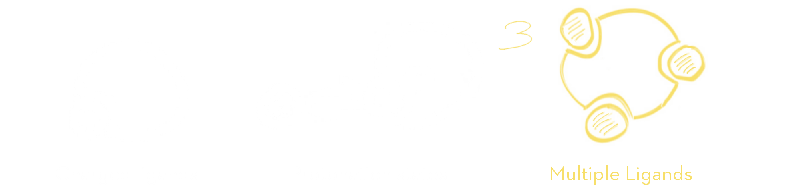

----

Binding of multiple ligands to a single target
==============================================

.. figure:: images/HSA.png
  :width: 600px
  
  A summary of human serum albumin (HSA) crystal structures bound to small molecules.

  Ghuman, J et al. *J Mol Biol* 2005, 353, 38–52

----

Binding of multiple ligands to a single target
==============================================

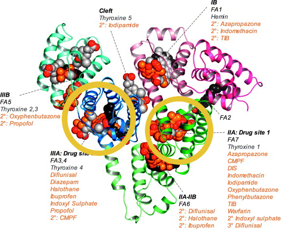
  
  A summary of human serum albumin (HSA) crystal structures bound to small molecules.

  Ghuman, J et al. *J Mol Biol* 2005, 353, 38–52

----

Binding of multiple ligands to a single target
==============================================

Human serum albumin
-------------------

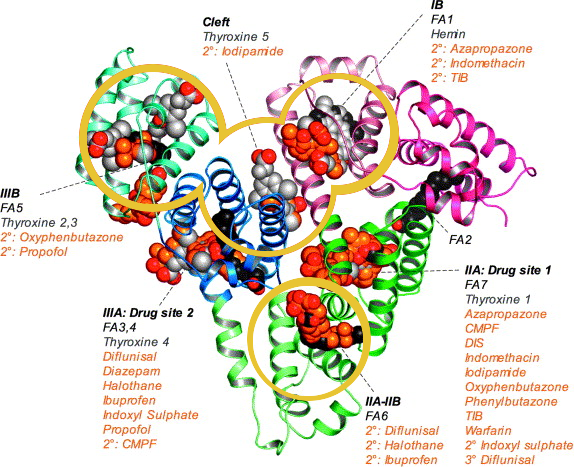
  
  A summary of human serum albumin (HSA) crystal structures bound to small molecules.

  Ghuman, J et al. *J Mol Biol* 2005, 353, 38–52

----

Binding of multiple ligands to a single target
==============================================

Fragment based drug discovery
-----------------------------

+--------------------------------------------------+-------------------------------------------+
| .. figure:: images/hts.jpg                       | .. figure:: images/fbdd.jpg               |
|   :width: 300px                                  |   :width: 350px                           |
|                                                  |                                           |
|   A conventional high-throughput screening hit.  |   A fragment hit that is later optimized. |
+--------------------------------------------------+-------------------------------------------+

Rees, DC et al. *Nature Reviews Drug Discovery* 2004, 3, 660-67

----

Binding of multiple ligands to a single target
==============================================

Fragment based drug discovery
-----------------------------

At high concentrations, multiple fragments can bind to a protein
................................................................

The binding of 3 fragments to p38a kinase.

+------------------------------------------+--------------------------------------+
| .. figure:: images/fragment_p38_4ehv.png | .. figure:: images/fragment_4ehv.png |
|   :width: 400px                          |   :width: 200px                      |
|                                          |                                      |
|   PDB: 4EHV                              |   PDB: 0SJ                           |
|                                          |                                      |
+------------------------------------------+--------------------------------------+

Over B et al. *Nat Chem* 2013 Jan;5(1):21-8

----

Weak binding of fragments
=========================

Consequences of the strong binding approximation
------------------------------------------------

+---------------------------------------+-----------------------------------+
| .. figure:: images/gilson.png         | .. figure:: images/squarewell.png |
|   :width: 400px                       |   :width: 300px                   |
+---------------------------------------+-----------------------------------+
| .. figure:: images/strong_binding.png |                                   |
|   :width: 400px                       |                                   |
+---------------------------------------+-----------------------------------+

----

:id: aim1

Establish a correct quantitative treatment of alchemical free energy calculations for binding of charged ligands
================================================================================================================
Aim 1.
------

----

Establish a correct quantitative treatment of alchemical free energy calculations for binding of charged ligands
================================================================================================================
Aim 1.
--------

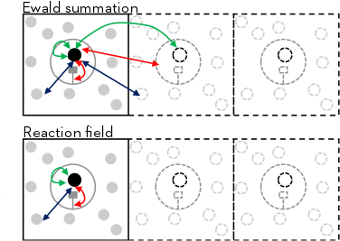
  
  Bulk liquids are approximated in simulation, either by using periodic boundary conditions, or an implicit solvent.
  Often, to further reduce computation cost, we introduce truncated,potentials and non-Coulombic electrostatics (such as **particle mesh Ewald** [PME],and **reaction field** [RF] potentials).

Reif, MM  and Oostenbrink, C  *J Comput Chem*  35.3  pp. 227–243 (2013)

----

Ewald summation as a long range electrostatics approxmation
===========================================================

+-------------------------------------------------+-------------------------------------------------------------+
| .. figure:: images/pbc_ewald.png                | .. figure:: images/ewald.png                                |
|   :width: 300px                                 |   :width: 300px                                             |
|                                                 |                                                             |
|   An infinitely periodic system as a lattice.   |   Charges are additionally described with distributions.    |
+-------------------------------------------------+-------------------------------------------------------------+

.. note::
  real space part: Ureal = 1/2 sum i=1 to N sum j=1 to N sum \|n\| =0 to infinity (qi qj)/(4pi eps0)  * erfc(alph \|rij + n\|)/ \|rij +n\|
  
  reciprocal space part: U_reci = 1/2 sum k \ne 0 sum i=1 to N sum j=1 to N (qi qj)/(4pi eps0)  4 pi^2 /k^2 exp (- k^2/4alph^2) cos(k*rij)
  
  subtract self term:  - \alpha/ sqr(pi) sum k=1 to n  q^2_k / (4pi eps0)
  
  correction if not tin foil: (2pi)/(3L^3) sum =1 to N (qi/(4pi eps0) ri )^2
  

----

Ewald summation
===============

Neutralizing the system charge
------------------------------

There is an effective system neutralizing charge, called jellium/gellium.

This system wide charge density ρ depends on the box size, L.

+-------------------------------------------------+-------------------------------------------------------------------+
| .. figure:: images/pbc_ewald.png                | .. figure:: images/colored_gellium.png                            |
|   :width: 300px                                 |   :width: 400px                                                   |
|                                                 |                                                                   |
|   An infinitely periodic system as a lattice.   |   The charge density in the system is a function of the box size. |
+-------------------------------------------------+-------------------------------------------------------------------+

Here, **k** stands for the different boxes in the lattice, and **i** indicates individual point charges **q\_i**, with their position vectors **r⃗**.

----

Ewald summation
===============

Neutralizing the system charge
------------------------------

There is an effective system neutralizing charge, called jellium/gellium.

This system wide charge density ρ depends on the box size, L.

+---------------------------------------------------------+-------------------------------------------------------------------+
| .. figure:: images/box_sizes.png                        | .. figure:: images/colored_gellium.png                            |
|   :width: 300px                                         |   :width: 400px                                                   |
|                                                         |                                                                   |
|   The charge density differs between complex and ligand |   The charge density in the system is a function of the box size. |
|   because of a net charge change and the box size.      |                                                                   |
+---------------------------------------------------------+-------------------------------------------------------------------+

----

:id: aim1-corrections

Establish a correct quantitative treatment of alchemical free energy calculations for binding of charged ligands
================================================================================================================
Aim 1.
------

A number of corrections have been proposed but:
 * They have not been compared to each other
 
   * Not used on the same systems
   
 * Quantitative correctness of these methods has not been established
 
   * Not compared to experiment!

Sources:
 - Reif MM and Oostenbrink C *J Comput Chem* 35.3 , pp. 227–243 (2013)
 - Rocklin Gj et al. *J Chem Phys* 139.18 , p. 184103. (2013)
 - Lin YL et al. *J Chem Theory Comput* 10.7, pp. 2690–2709. (2014)

----

Compare the different charge correction models
==============================================

We will consider these approaches:

* Reif and Oostenbrink use thermodynamic cycles to eliminate individual components.
* Rocklin et al. use Poisson-Boltzmann calculations to quantify the erroneous contributions.
* Lin et al. use potential of mean force (PMF) calculations in a large simulation system, pulling the ligand away from the protein non-alchemically.
* Eliminating a pair of ions, with a net charge of **0**.

We will first check if the methods produce the same quantitative estimate.
Next, we will compare to experiment, to see if they produce a quantitatively correct answer.

This is the first comparison of any of these methods on the same system!

----

:id: aim1-modelsystem

The host-guest model system
===========================

Aim 1
-----

We will use cucurbit-\[7\]-uril as a model system

+-----------------------------------+------------------------------------+----------------------------------------------------------------------------------+
| .. image:: images/guest11_top.png | .. image:: images/guest11_side.png | The system is useful because:                                                    |
|   :width: 200px                   |   :width: 200px                    |                                                                                  |
|                                   |                                    | * Both guest and hosts are very soluble                                          |
+-----------------------------------+------------------------------------+ * They are small, with few degrees of freedom                                    +
| .. image:: images/Kd_guest2.png                                        | * The affinities are in the range of typical protein-small molecule interactions |
|   :width: 410px                                                        |                                                                                  |
+------------------------------------------------------------------------+----------------------------------------------------------------------------------+

----

Experimental validation
=======================

* We will use *alchemical free energy calculations* to predict binding free energies, while we compare various approaches to each other

* At the same time, we will perform *isothermal titration calorimetry* (ITC) experiments that can validate the different corrections.

----

Isothermal titration calorimety
===============================

The instrument
--------------

+-------------------------------------+
| .. image:: images/itcinstrument.jpg |
|   :width: 400px                     |
+-------------------------------------+

Zhou et al. *Nature Protocols* 6, 158–165 (2011)

----

Isothermal titration calorimety
===============================

The data obtained
-----------------

+-------------------------------------+
| .. image:: images/itcinstrument.jpg |
|   :width: 200px                     |
+-------------------------------------+
| .. image:: images/itcexample.jpg    |
|   :width: 650px                     |
+-------------------------------------+

Zhou et al. *Nature Protocols* 6, 158–165 (2011)
http://www.biochemistry.ucla.edu/biochem/shared/instruments/Isothermal.html

----

Isothermal titration calorimety
===============================

The data obtained
-----------------

+-------------------------------------+
| .. image:: images/itcexample.jpg    |
|   :width: 650px                     |
+-------------------------------------+

Zhou et al. *Nature Protocols* 6, 158–165 (2011)
http://www.biochemistry.ucla.edu/biochem/shared/instruments/Isothermal.html

----

Isothermal titration calorimetry
================================

There are some issues with the standard analysis...
---------------------------------------------------

----

Binding of CBS to carbonic anhydrase
====================================

Observations from tbe ABRF-MIRG'02 study
----------------------------------------

+-------------------------------------+-------------------------------------+
| .. figure:: images/abrf_mirg.png    | .. image:: images/itcexample_r.jpg  |
|   :width: 500px                     |   :width: 250px                     |
+-------------------------------------+-------------------------------------+

  
  Myszka DG et al. *J Biomol Tech* 2003 Dec; 14(4):247-69

----

Observed errors can directly be correlated to errors in concentration
=====================================================================

The extinction coefficient

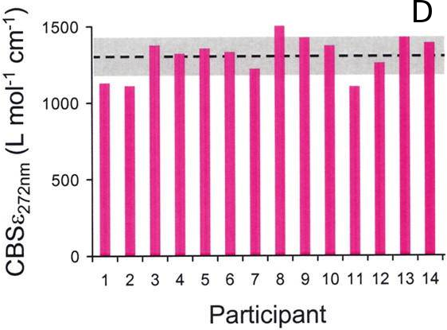

From the lambert beer law:
  .. figure:: images/colored_extinction.png
    :width: 150px
    
    where A is absorbance, c is concentration and l is the pathlength

----

If there are so many issues...
==============================

Why still use ITC?
------------------

----

Isothermal titration calorimetry
================================

* Gives direct access to the thermodynamic properties of a binding reaction, directly related to alchemical free energy calculations!
  
  * You can obtain both the enthalpy and free energy
* There is no need for fluorescent scaffolds or tags
* There HAS to be a way to quantify the uncertainty accurately

----

Isothermal titration calorimetry
================================

* Gives direct access to the thermodynamic properties of a binding reaction, directly related to alchemical free energy calculations!
  
  * You can obtain both the enthalpy and free energy
* There is no need for fluorescent scaffolds or tags
* There HAS to be a way to quantify the uncertainty accurately
  
  * And there is! And it is called **Bayesian inference**.

----

:id: aim1-bitc

Accurately quantify experimental uncertainty using Bayesian inference.
=====================================================================================================

The experimental parameters, θ , can be estimated using Bayes rule:

* **P(θ\|D)** is the *posterior* distribution. The probability of the parameters given the observed data. *This is what we want to know!*
* **P(D\|θ)** is the *likelihood*. The probability of the observed data, given a single set of parameters.
* **P(θ)** are *prior* distributions, containing prior information. We can use this to propagate errors such as known errors in reagent concentrations.

----

:id: aim1-mcmc

Sampling from a posterior distribution using MCMC
=================================================

Markov Chain Monte Carlo
------------------------

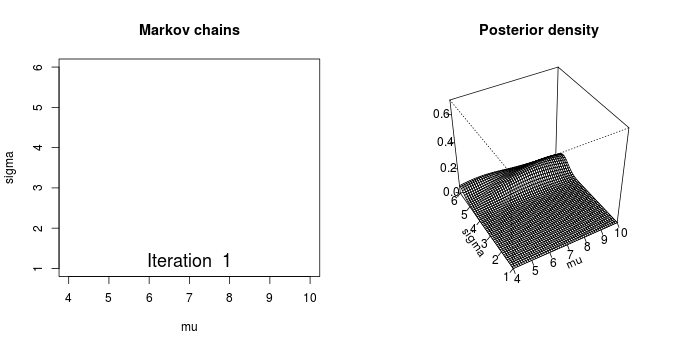

  http://mbjoseph.github.io/blog/2013/09/08/metropolis/
  
----

:id: aim1-parameters

Develop an accurate approach to quantifying experimental uncertainty in ITC using Bayesian inference.
=====================================================================================================

Subaim 1.1
----------

The ITC model structure
.......................

  
Thermodynamic parameters include
  
  - binding affinity, |lt_dG|
  
  - enthalpy of binding, |lt_dH|
  
  - mechanical heats offset, |lt_H0|
  
  - concentration of syringe component, |lt_Xs|
  
  - concentration of cell component, |lt_Mc|
  
  - noise parameter, |lt_sigma|

We can use prior distributions |lt_prior| to propagate error estimates in concentrations, and include previous measurements.

----

:id: aim1-likelihood

Develop an accurate approach to quantifying experimental uncertainty in ITC using Bayesian inference.
=====================================================================================================

Subaim 1.1
----------

The ITC model structure
.......................

+--------------------------------------------------------------+-----------------------------------------------+
| The likelihood model, |lt_likelihood|, is defined as         | .. image:: images/normal.png                  |
|                                                              |   :height: 350px                              |
| .. image:: images/colored_model.png                          |                                               |
+--------------------------------------------------------------+-----------------------------------------------+
| Where the observed heats are sampled from a normal distribution |lt_norm|, with a variance of |lt_variance|. |
+--------------------------------------------------------------------------------------------------------------+

----

What will our experimental results look like?
=============================================

+---------------------------------+--------------------------------------+
| .. image:: images/itcexp.png    | .. image:: images/postpredictive.png |
|   :width: 400px                 |   :width: 400px                      |
+---------------------------------+--------------------------------------+

----

(Backup) Slides on individual corrections
=========================================

:id: aim1-subaims

Establish a correct quantitative treatment of alchemical free energy calculations for binding of charged ligands
================================================================================================================
Aim 1.
------

Subaim 1.1:  Develop an accurate approach to quantifying experimental uncertainty in ITC using Bayesian inference.
..................................................................................................................

Because we need a reliable experimental dataset in order to make a quantitative comparison

Subaim 1.2: Perform a quantitative comparison of suggested correction models to experiments to establish a correct treatment of charged ligands in alchemical free energy calculations.
.......................................................................................................................................................................................

Evaluating the charge corrections, testing an alternative (counter ions), comparing to each other and experiment

----

:id: aim2

Quantify the magnitude of protonation state effects on binding
==============================================================
  
Aim 2.
------

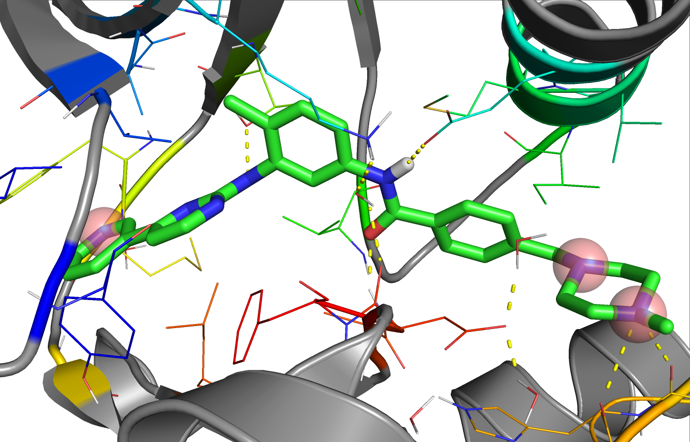
  

----

:id: aim2-intro

Quantify the magnitude of protonation state effects on binding
==============================================================
  
Aim 2.
------

Proteins and many small-molecule drugs contain titratable moieties that can change protonation state upon binding or sample mixtures of protonation states, often in a conformation-dependent manner.

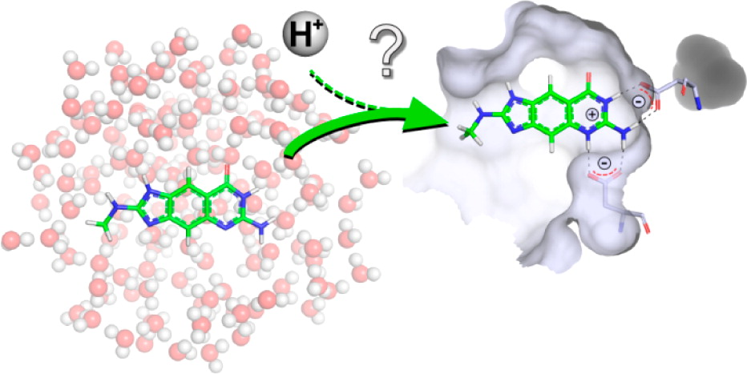
    
  *The pH dependent effect in lin-benzoguanines binding to tRNA−guanine transglycosylase* [#]_
    

.. [#] Chasing Protons: .... ,  Neeb et al. *J. Med. Chem.*, 2014, 57 (13), pp 5554–5565

----

:id: aim2-kinase

Protonation states are relevant to kinase inhibitors
====================================================

* Kinases are hugely important targetsfor anti cancer drugs.

* Evidence exists that for the binding of imatinib to Abl kinase, pH dependent effects may contribute to the binding affinity, and preliminary data indicates that it is the same for *many other kinase inhibitors*.

+---------------------------------------+--------------------------------------------+
| .. image:: images/inhibitor-pKas.png  | .. image:: images/imatinib_image_curve.png |
|   :width: 300px                       |   :width: 300px                            |
+---------------------------------------+--------------------------------------------+

----

:id: aim2-subaims

Quantify the magnitude of protonation state effects on binding
==============================================================
  
Aim 2.
------

Subaim 2.1: Benchmark small molecule pKa prediction tools against experimental data for kinase inhibitors.
..........................................................................................................
We need reliable pKa estimates of small molecule kinase inhibitors. We will benchmark available tools and compare to experimental data.

Subaim 2.2: Survey the kinase:inhibitor cocrystal structures for possible protonation state effects in inhibitor binding.
.........................................................................................................................
We will identify kinase-inhibitor systems that show changes in the populations of protonation states from MCCE calculations.

Subaim 2.3: Dissect the determinants and impact of protonation state effects on binding affinity through free energy calculations and ITC experiments.
......................................................................................................................................................
The systems identified will be simulated using alchemical free energy calculations, and we will perform ITC experiments on them.
 
----

:id: subaim-2.1

Benchmark small molecule pKa prediction tools against experimental data for kinase inhibitors.
==============================================================================================

Subaim 2.1
----------

----

Experimental data
=================

** Add image T3 data & instrument **

For the sake of having a completely computational framework to perform these calculations, we would like to find a reliable predictor.

----

We will benchmark small molecule pKa prediction tools against this data.
========================================================================

* **MoKa** generates pKa s based on atomistic descriptors, defined by the surrounding atoms. The descriptors are based on molecular interaction fields calculated using GRID for a library of 3D fragments, but can successfully be applied on 2D structures.
 
* Schrodinger’s **Jaguar** provides means of estimating pKa values using quantum mechanical methods.
 
* **Epik** uses Hammett Taft linear free energy approaches [86] for predicting pKa values.

----

Identify kinase systems where protonation state changes could be important.
===========================================================================

----

:id: subaim-2.2

Survey the kinase:inhibitor cocrystal structures for possible protonation state effects in inhibitor binding.
=============================================================================================================

Subaim 2.2
----------

We will investigate complex structures from the protein databank, using a framework called MCCE.

  

----

Survey the kinase:inhibitor cocrystal structures for possible protonation state effects in inhibitor binding.
=============================================================================================================

MCCE samples multiple conformations of protein side-chains and estimates the most probably protonation state.
The framework has been extended to incorporate sampling of ligands. We will keep ligand conformations fixed to those found in crystal structures.

Subaim 2.2
----------
  
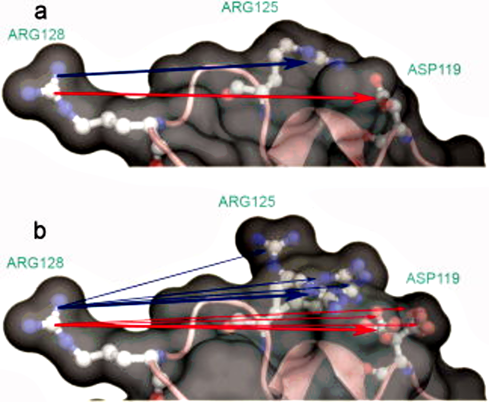

----

:id: subaim-2.3

Dissect the determinants and impact of protonation state effects on binding affinity through free energy calculations and ITC experiments.
==========================================================================================================================================

Subaim 2.3
----------

We will perform alchemical free energy calculations using a dynamic protonation state scheme also known as *constant-pH* simulations.

These calculations will use the pKa predictions provided by our pKa tool of choice.

.. note::
  Or our experimental estimates, if the pKa tools dont perform well enough.
  
We will quantify

  * The total free energy of binding and,
  * The contribution of protonation state changes to the total.
  * Perform complementary ITC experiments to validate the free energy calculations
  
----

Constant-pH alchemical free energy calculations
===============================================

----

Calculating free energy of protonation contribution
===================================================

----

ITC experiments to disseminate protonation state effects from binding
=====================================================================

Using buffers with different ionization enthalpy
------------------------------------------------

In order to detect protonation state effects in ITC, we can perform multiple experiments that have different *ionization enthalpies*.
This will lead to different magnitude contributions to the binding affinity, which will allow us to detect and quantify net protonation state effects.

----

Alternatives
============

----

Develop a framework for alchemical free energy calculations to describe weak association and cooperative ligand binding.
========================================================================================================================

Aim 3.
------

Weak binding and association of multiple ligands to proteins are ubiquitous interactions in biological and pharmaceutically relevant systems.

It is particularly common when using drug discovery approaches such as fragment-based ligand design, where concentrations are scaled up to detect weak binding signals, often resulting in multiple associating fragments.

Most available free energy calculation frameworks focus on 1:1 binding interactions, and are not suited for calculating free energies of an arbitrary number of ligands.

**We will overcome deficiencies in current frameworks with a new framework that can provide predictions for ligands binding multiple times to a single macromolecule.**

----

Develop a framework for alchemical free energy calculations to describe weak association and cooperative ligand binding.
========================================================================================================================

Aim 3.
------

Subaim 3.1: Extend alchemical free energy calculations to simulate multiple ligand binding.
...........................................................................................

Current frameworks are focussed on single ligand (1:1) association to proteins

Subaim 3.2: Validate computational predictions by applying Bayesian model selection on ITC  experiments of HSA and a series of NSAIDs.
......................................................................................................................................

We will expand the Bayesian ITC framework (Aim 1) to incorporate multiple ligand binding.

----

An alchemical ladder between stoichiometric states
==================================================

----

Extend alchemical free energy calculations to simulate multiple ligand binding.
===============================================================================

Subaim 3.1
----------

----

:id: subaim3.2

Validate computational predictions by applying Bayesian model selection on ITC  experiments of HSA and a series of NSAIDs.
==========================================================================================================================

Subaim 3.2
----------

----

That's all folks!
=================
