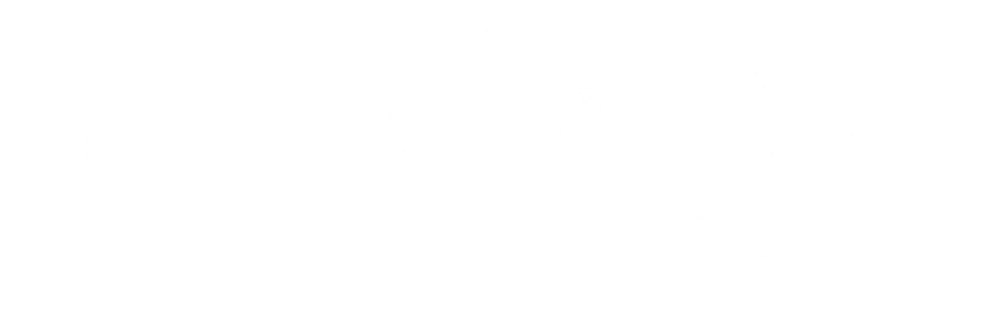
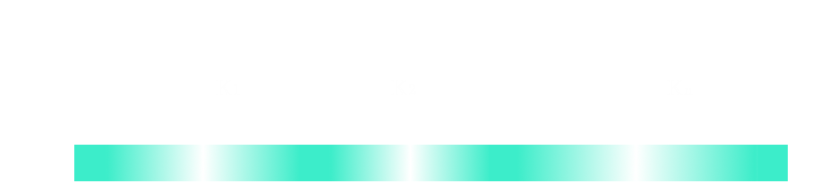

:title: Ace Exam
:author: Bas Rustenburg
:description: Admission to candidacy exam
:keywords: exam, ace, phd
:css: ace.css

.. |lt_theta| image:: images/colored_theta.png
.. |lt_prior| image:: images/colored_prior.png
.. |lt_posterior| image:: images/colored_posterior.png

.. |lt_model| image:: images/colored_model.png
.. |lt_Bayes| image:: images/colored_bayes_rule.png
.. |lt_dG| image:: images/colored_dG.png

.. |lt_Xs| image:: images/colored_Xs.png

.. |lt_sigma| image:: images/colored_sigma.png
.. |lt_norm| image:: images/colored_norm_n.png
.. |lt_variance| image:: images/colored_variance.png

:data-transition-duration: 1

----

:id: title

Admission to candidacy exam
===========================

Bas Rustenburg
--------------

Date : 5/29
...........

.. image:: images/background.png
  :align: center
  :width: 90%

----

The efficiency of the pharmaceutical industry has been declining for years
==========================================================================

.. figure:: images/erooms.jpg
  :width: 90%
  
  Kack W. Scannell et al. *Nature Reviews Drug Discovery* 11, 191-200 (2012)

----

It takes up to 4.5 years and 219 million dollars to develop a potent binder
===========================================================================

  
  Paul, SM, et al. *Nature Reviews Drug Discovery* 9, 203-214 (2010)
  
  Each consecutive step only gets more expensive!

----

There is a clear need for a cheaper strategy
============================================

Computational approaches offer a cheap solution
-----------------------------------------------

* They benefit from Moore's law, with *increased computational efficiency each year*

* Ability to study *hypothetical small molecules*

* Allow for *faster* and *cheaper* generation of drug candidates
  
  * More leads to follow in the later stage, reducing failure rate.

.. note::
  Give us more chances to hit our target.
  
  Maybe some leads will be toxic, of have ADME issues
   
  For instance,
  * compounds that have not been synthesized.
  * when protein is expensive.
  * When you cant reach concentrations of poorly soluble drugs.

----

It is all about the binding affinity
====================================

A strong binder minimizes the ratio of free protein (**[P]**) and ligand (**[L]**) over complex concentration (**[PL]**).

This is known as the dissociation constant (**Kd**), often used synonymously with the binding affinity.

This can be related to the free energy of binding, **ΔG**.

+--------------------------------------+
| .. image:: images/colored_PL.png     |
|   :width: 50%                        |
+--------------------------------------+
| .. image:: images/colored_kdkoff.png |
|   :width: 70%                        |
+--------------------------------------+
| .. image:: images/colored_Kd.png     |
|   :width: 60%                        |
+--------------------------------------+

----

:id: docking

Molecular docking for affinity estimation
=========================================

+----------------------------------------------+------------------------------------------------------------+
| .. figure:: images/docking.gif               | .. figure:: images/scoring.jpg                             |
|   :width: 90%                                |   :width: 90%                                              |
|                                              |                                                            |
|   Molecule is docked into a rigid receptor   |   Free energy is estimated by a scoring function.          |
+----------------------------------------------+------------------------------------------------------------+

----

Docking does not provide accurate estimates
===========================================

+---------------------------------+
| .. figure:: images/docking.png  |
|   :width: 60%                   |
|                                 |
+---------------------------------+
  
  *For prediction of compound affinity, none of the docking programs or scoring functions made
  a useful prediction of ligand binding affinity.* At most, the top 10-20% cores shows an enrichment in binders.
  
  Warren et al. *J Med Chem* 49 (20), pp 5912–5931 (2006)

----

:id: deshaw

If you have a fast super-computer
=================================

You can simulate binding in from *microsecond timescale* MD simulations.

.. image:: images/deshaw2.gif

For typical drug off-rates, trajectories would need to be impractically long (hours), requiring ~100 million CPU-years to simulate.

.. note::
  imatinib to abl:
   * kon 0.146 uM s-1
   * koff 0.0022 s-1 (1/500s)
   
   Say we need 100 events. 50 000 seconds needed
   (50 000 seconds) / (100 (nanoseconds / gpu days)) =
   1.36895463 billion gpu years
  
   

----

Alchemical free energy calculations
===================================

(in principle) allow for us to calculate affinities indirectly.
---------------------------------------------------------------

+------------------------------------------------+
| .. image:: images/colored_Kd.png               |
|   :width: 60%                                  |
+------------------------------------------------+
| .. image:: images/alchemical_intermediates.png |
|   :width: 80%                                  |
+------------------------------------------------+

Chodera, JD et al. *Curr Opin Struct Biol*, 21:150 (2011)

----

Successful applications
=======================

Schrodinger has shown that their free energy calculation framework can calculate binding free energies that are:
 
 * Close to experimental estimates
 
 * Transferrable to several different systems
 

.. figure:: images/schrodinger.jpg
  :width: 60%

Wang, L et al. *J Am Chem Soc* 137 (7), pp 2695–2703 (2015)

----

Alchemical free energy calculations
===================================

There are deficiencies that need to be addressed before alchemical free energy calculations can be applied widely.

.. image:: images/alchem_aims_red.png
  :width: 95%

----

:id: spec-aims

Alchemical free energy calculations
===================================

There are deficiencies that need to be addressed before alchemical free energy calculations can be applied widely.

----

Alchemical free energy calculations
===================================

There are deficiencies that need to be addressed before alchemical free energy calculations can be applied widely.

.. image:: images/alchem_aims_red.png
  :width: 95%
  

We will resolve deficiencies by using a combination of *theory* and *experiments*.

----

:id: aim1

Establish a correct quantitative treatment of alchemical free energy calculations for binding of charged ligands
================================================================================================================
Aim 1.
------

.. image:: images/alchem_aims_charge.png
  :width: 95%

----

Disease relevant charged ligands
================================

+-----------------------------------+-----------------------------------+
| .. figure:: images/saquinavir.png | .. figure:: images/nelfinavir.png |
|   :width:  50%                    |   :width:  60%                    |
|                                   |                                   |
|   Saquinavir                      |   Nelfinavir                      |
+-----------------------------------+                                   +
| .. figure:: images/indinavir.png  |                                   |
|   :width:  50%                    |                                   |
|                                   |                                   |
|   Indinavir                       |                                   |
+-----------------------------------+-----------------------------------+

Protease inhibitors typically have positive charges. For instance these FDA approved *HIV-protease inhibitors*.

(image source: www.chemicalize.org)

----

Disease relevant charged ligands
================================

+--------------------------------+----------------------------------+
| .. figure:: images/aspirin.png | .. figure:: images/ibuprofen.png |
|   :width:  50%                 |   :width:  50%                   |
|                                |                                  |
|   Aspirin                      | Ibuprofen                        |
+--------------------------------+----------------------------------+
  
Many over-the-counter *nonsteroidal anti-inflammatory drugs* have charged moieties!

(image source: www.chemicalize.org)

----

Disease relevant charged ligands
================================

Anti-histamines
---------------

+----------------------------------+-----------------------------------------+
| .. figure:: images/histamine.png | .. figure:: images/diphenhydramine.png  |
|   :width: 70%                    |   :width: 40%                           |
|                                  |                                         |
|   Histamine                      |   Benadryl (diphenhydramine)            |
|                                  +-----------------------------------------+
|                                  | .. figure:: images/azelastine.png       |
|                                  |   :width: 40%                           |
|                                  |                                         |
|                                  |   Astelin (azelastine)                  |
+----------------------------------+-----------------------------------------+

(image source: www.chemicalize.org)

----

Why are there issues with in charged ligands?
=============================================

Bulk liquids are huge, therefore, a number of approximations are made:

* Periodic boundary conditions, or implicit solvents

* Truncating electrostatic potentials (cut-offs)

* Non-coulombic long-range electrostatics
  
  * Ewald summation (or particle mesh Ewald, PME)
  * Reaction field models (RF)

.. figure:: images/reif_oostenbrink.png
  
Reif, MM  and Oostenbrink, C  *J Comput Chem*  35.3  pp. 227–243 (2013)

----

Issues arrising from using Ewald summation
==========================================

Neutralizing the system charge
------------------------------

There is an effective system neutralizing charge, called jellium/gellium.

This system wide charge density **ρ** depends on the box size, **L**.

+---------------------------------------------------------+-------------------------------------------------------------------+
| .. figure:: images/box_sizes.png                        | .. figure:: images/colored_gellium.png                            |
|   :width: 50%                                           |   :width: 90%                                                     |
|                                                         |                                                                   |
|   The charge density differs between complex and ligand |   The charge density in the system is a function of the box size. |
|   because of a net charge change and the box size.      |                                                                   |
+---------------------------------------------------------+-------------------------------------------------------------------+

Lin YL et al. *J Chem Theory Comput* 10.7, pp. 2690–2709. (2014)

----

What can be done to resolve the issues?
=======================================

A number of corrections have been proposed but:
 * They have not been compared to each other
 
   * Not used on the same systems
   
 * Quantitative correctness of these methods has not been established
 
   * Not compared to experiment!

Sources:
 - Reif MM and Oostenbrink C *J Comput Chem* 35.3 , pp. 227–243 (2013)
 - Rocklin GJ et al. *J Chem Phys* 139.18 , p. 184103. (2013)
 - Lin YL et al. *J Chem Theory Comput* 10.7, pp. 2690–2709. (2014)

----

Compare the different charge correction models
==============================================

We will consider these approaches:

* Reif and Oostenbrink use thermodynamic cycles to eliminate individual components.
* Rocklin et al. use Poisson-Boltzmann calculations to quantify the erroneous contributions.
* Lin et al. use potential of mean force (PMF) calculations in a large simulation system, pulling the ligand away from the protein non-alchemically.
* Eliminating a pair of ions, with a net charge of **0**.

1. We will check if the methods produce the *same quantitative estimate*.

2. We will compare to experiment, to see if they produce a *quantitatively correct answer*.

This is the first comparison of any of these methods on the same system!

----

What system will we use to test?
================================

Cucurbit-\[7\]-uril as a model system
-------------------------------------

+-----------------------------------+------------------------------------+
| .. image:: images/guest11_top.png | .. image:: images/guest11_side.png |
|   :width: 50%                     |   :width: 50%                      |
|                                   |                                    |
+-----------------------------------+------------------------------------+

.. note::
  
  *It binds cationic guests*
  

----

Hosts are the active component in Febreze!
==========================================

.. image:: images/febreze.jpg

----

Cucurbit-\[7\]-uril as a model system
=====================================

+-----------------------------------+------------------------------------+----------------------------------------------------------------------------------+
| .. image:: images/guest11_top.png | .. image:: images/guest11_side.png | The system is useful because:                                                    |
|   :width: 70%                     |   :width: 70%                      |                                                                                  |
|                                   |                                    | * Both guest and hosts are very soluble                                          |
+-----------------------------------+------------------------------------+ * They are small, with few degrees of freedom                                    +
| .. image:: images/Kd_guest2.png                                        | * The affinities are in the range of typical protein-small molecule interactions |
|   :width: 70%                                                          |                                                                                  |
+------------------------------------------------------------------------+----------------------------------------------------------------------------------+

----

Experimental validation
=======================

In order to *quantitatively validate the free energy correction methods*, we will be performing experiments to measure the free energy of binding.

* We will perform *isothermal titration calorimetry* (ITC) experiments that can validate the different corrections.

* ITC experiments are very compatible with free energy calculations because you *directly measure thermodynamic characteristics* of binding

  * The *free energy*, and *enthalpy*

----

ITC experiments
===============

Host-guest data have a high signal to noise because of the solubility, making it excellent for a quantitative test of our approach.

+--------------------------------------+-------------------------------------+
| .. image:: images/itcexp.png         | .. image:: images/itcinstrument.jpg |
|   :width: 90%                        |   :width: 90%                       |
+--------------------------------------+-------------------------------------+

Zhou et al. *Nature Protocols* 6, 158–165 (2011)

----

Isothermal titration calorimety
===============================

Analysis
---------

Parameters are fit to the integrated peaks
..........................................

+-------------------------------------+
| .. image:: images/itcexample.jpg    |
|   :width: 90%                       |
+-------------------------------------+

http://www.biochemistry.ucla.edu/biochem/shared/instruments/Isothermal.html

.. note::
  The heats are fit to the equation

  Qi = V * n * H * [PL]
  deltaQ is heat per injection

----

Isothermal titration calorimetry
================================

There are some issues with the standard analysis...
---------------------------------------------------

----

Binding of CBS to bovine carbonic anhydrase II
==============================================

Observations from the ABRF-MIRG'02 study
----------------------------------------

+-------------------------------------+--------------------------------------+
| .. figure:: images/abrf_mirg.png    | .. figure:: images/itcexample_r.jpg  |
|   :width: 70%                       |   :width: 110%                       |
+-------------------------------------+--------------------------------------+

  
Myszka DG et al. *J Biomol Tech* 2003 Dec; 14(4):247-69

.. note::
  Association of Biomolecular Resource Facilities
  
  CBS stands for 4-carboxybenzenesulfonamide

----

Observed errors can directly be correlated to errors in concentration
=====================================================================

The extinction coefficient

.. figure:: images/extinction_mirg.png
  :width: 40%

From the Lambert-Beer law:
  .. figure:: images/colored_extinction.png
    :width: 30%
    
where A is absorbance, c is concentration and l is the pathlength

----

Why still use ITC?
==================

* No approximations/assumptions needed to access *thermodynamic properties* of a binding reaction

    * Therefore, they can be directly related to alchemical free energy calculations!

* There is no need for fluorescent scaffolds or tags

* There HAS to be a way to quantify the uncertainty accurately

  
  * We suggest using *Bayesian inference*.

----

Accurately quantify experimental uncertainty using Bayesian inference.
======================================================================

The experimental parameters, θ

  
can be estimated using Bayes rule:

.. figure:: images/colored_bayes_rule.png
  :width: 30%

* **P(θ\|D)** is the *posterior* distribution. The probability of the parameters given the observed data. *This is what we want to know!*
* **P(D\|θ)** is the *likelihood*. The probability of the observed data, given a single set of parameters.
* **P(θ)** are *prior* distributions, containing prior information. We can use this to propagate errors such as known errors in reagent concentrations.

----

Likelihood model of the data
============================

We assume the injection heats, q\_n are drawn from a normal distribution, with the true heats as a mean, and a variance **σ**.

+--------------------------------------+
| .. image:: images/colored_model.png  |
|   :width:  40%                       |
|                                      |
+--------------------------------------+
| .. image:: images/colored_qn_itc.png |
|   :width: 50%                        |
|                                      |
+--------------------------------------+
| .. image:: images/itc_test2.png      |
|   :width: 60%                        |
+--------------------------------------+

----

Accurately quantify experimental uncertainty using Bayesian inference.
======================================================================

Our posterior then becomes

.. figure:: images/hl_full_bayes.png
  :width: 60%

and to estimate the posterior, we can sample from it using techniques like *Markov Chain Monte Carlo* (MCMC).

----

Sampling from a posterior distribution using MCMC
=================================================

Markov Chain Monte Carlo
------------------------

.. figure:: images/mcmc.gif
  :width: 70%

  http://mbjoseph.github.io/blog/2013/09/08/metropolis/
  
----

Making our tools accessible as a library
========================================

The code is already available on github
---------------------------------------

https://github.com/choderalab/bayesian-itc

----

The uncertainty in the parameters
=================================

.. figure:: images/dHmcmc.png
  :width: 700px
  
----

Uncertainty in the data
=======================

Red dots • indicate observed data, violins depict the posterior distribution of each injection.
The family of models that were sampled are shown as black curves.

+--------------------------------------+
| .. image:: images/postpredictive.png |
|   :width: 70%                        |
+--------------------------------------+

----

Establish a correct quantitative treatment of alchemical free energy calculations for binding of charged ligands
================================================================================================================

Using the Cucurbit[7]uril host-guest system, we will

*1.1.* Develop an accurate approach to quantifying experimental uncertainty in ITC using Bayesian inference.

*1.2.* Perform a quantitative comparison of suggested correction models to experiment to establish a correct treatment of charged ligands in alchemical free energy calculations.

----

:id: aim2

Quantify the magnitude of protonation state effects on binding
==============================================================
Aim 2.
------

.. image:: images/alchem_aims_protonation.png
  :width: 70%

----

Quantify the magnitude of protonation state effects on binding
==============================================================
  
We do not know every relevant protonation state a priori, and how relevant they are to the binding affinity.

.. figure:: images/protonation.png
  :width: 90%
    
  *The pH dependent effect in lin-benzoguanines binding to tRNA−guanine transglycosylase*
    

Neeb et al. *J. Med. Chem.*, 2014, 57 (13), pp 5554–5565

.. note::
  Also known for proteases and... kinases.

----

Protonation states may vary for kinase inhibitors
=================================================

Imatinib, a potent inhibitor of Abl kinase
------------------------------------------

.. figure:: images/imatinib_image_curve.png
  :width: 50%

Szakács, Z. et al. *J Med Chem* 2005, 48, 249–255

.. note::
  Do not forget to mention that the protonated form of these inhibitors is charged

----

Protonation states may vary for kinase inhibitors
=================================================

Imatinib, a potent inhibitor of Abl kinase
------------------------------------------

.. image:: images/imatinib_sites.png
  :width: 50%

----

Protonation states may vary for kinase inhibitors
=================================================

Imatinib, a potent inhibitor of Abl kinase
------------------------------------------

+--------------------------------------+
| .. image:: images/imatinib_sites.png |
|   :width:  30%                       |
|                                      |
+--------------------------------------+
| .. image:: images/ima_cycle.png      |
|  :width: 50%                         |
|                                      |
+--------------------------------------+

Aleksandrov, A and Simonson, T *J Comput Chem* 31,7, pp. 1550–1560 (2010)

----

Protonation states are relevant to kinase inhibitors
====================================================

* Preliminary data indicates that it is the same for *many other kinase inhibitors*.

+---------------------------------------+
| .. image:: images/inhibitor-pKas.png  |
|   :width: 80%                         |
+---------------------------------------+

Preliminary data generated using Epik

Shelley, JC *J Comput -Aided Mol Des* 21, pp. 681–691 (2007)

----

Problems with the standard approach
===================================

1. If we observe significant mixtures of protonation states

2. The distribution of protonation states change significantly upon binding

Then the standard approach is **missing contributions of unknown magnitude**.

+-----------------------------------+----------------------------------+
| .. image:: images/histidine.png   | .. image:: images/lapatinib.png  |
|   :width: 90%                     |   :width: 50%                    |
|                                   |                                  |
+-----------------------------------+----------------------------------+

----

Survey the kinase:inhibitor cocrystal structures for possible protonation state effects in inhibitor binding.
=============================================================================================================

Perform a survey accross all (human) kinase complexes in the protein databank (PDB)
-------------------------------------------------------------------------------------------

.. image:: images/imatinib_sites.png
  :width: 60%
  
----

Our aim is to identify kinase systems where protonation state effects influence binding
=======================================================================================

to quantify the effect of protonation state effects on the binding affinity of kinase inhibitors.
-------------------------------------------------------------------------------------------------

* There are 3500+ kinase:inhibitor complex structures in the protein databank.

* Using a simple tool, we want to survey them to narrow down to a set of max 100 complexes that show changes in the protonation state.

* Once identified, we will use alchemical free energy calculations, extended to sample protonation states, and perform experiments to validate them.

----

Multi-conformation continuum electrostatic (MCCE)
=================================================

* MCCE samples multiple conformations of protein side-chains

* It allows for random changes to the protonation state using Monte Carlo

* We will extend the framework to incorporate sampling of ligands protonation states.

+-------------------------------------+
| .. image:: images/dGprotonation.png |
|   :width: 500px                     |
|                                     |
+-------------------------------------+
| .. image:: images/mcce2_sharp.png   |
|   :width: 400px                     |
|                                     |
+-------------------------------------+

.. note::
  G elec is the electrostatic component of the free energy calculated for the titratable group in the protein,
 
  G elec,ref is the electrostatic component of the transition free energy for the reference compound
 
  Ref is peptide in solution

----

Multi-conformation continuum electrostatic (MCCE)
=================================================

* We will extend the framework to incorporate sampling of ligands protonation states.

+--------------------------------------+
| .. image:: images/dGprotonation2.png |
|   :width: 500px                      |
|                                      |
+--------------------------------------+

* Reference values are only available for amino acids

* We need pKa estimates for ALL the kinase inhibitors studied!

----

We will benchmark small molecule pKa prediction tools against experimental data data.
=====================================================================================

* There is pKa data available for a number of kinase inhibitors that are FDA approved.

* Using this data, we will benchmark available pKa prediction tools.

Szakács Z, et al. *J Med Chem* 48, 249–255 (2005)

----

The pKa tools we will consider
==============================

* **MoKa** generates pKa s based on atomistic descriptors, defined by the surrounding atoms. The descriptors are based on molecular interaction fields calculated using GRID for a library of 3D fragments, but can successfully be applied on 2D structures.
 
* Schrodinger’s **Jaguar** provides means of estimating pKa values using quantum mechanical methods.
 
* **Epik** uses Hammett Taft linear free energy approaches for predicting pKa values.

----

There are a lot of rough approximations in MCCE
===============================================

+-------------------------------------+
| .. image:: images/mcce2_sharp.png   |
|   :width: 400px                     |
|                                     |
+-------------------------------------+

* No dynamics included of the protein backbone

* A single ligand orientation (crystal structure)

Therefore we can only use it to survey and not to quantify.

----

We will use alchemical free energy calculations to quantify
===========================================================
    

  * The total free energy of binding
  * The contribution of protonation state changes to the total.
  
  * We will implement a Monte Carlo titration scheme
  
  +-------------------------------------+
  | .. image:: images/dGprotonation.png |
  |   :width:      50%                  |
  |                                     |
  +-------------------------------------+
  
  
  * Perform complementary ITC experiments to validate the free energy calculations
  
----

ITC experiments to disseminate protonation state effects from binding
=====================================================================

* We can use *multiple experiments in different buffers* to detect protonation state effects in ITC

* Because of different *ionization enthalpies*, if a proton is exchanged with the buffer, there will be a different enthalpy of binding.

.. image:: images/buffer_dependency.gif
  :width: 50%

Neeb et al. *J. Med. Chem.*, 2014, 57 (13), pp 5554–5565
 
----

Quantify the magnitude of protonation state effects on binding
==============================================================

We will identify kinase-inhibitor systems that show changes in the populations of protonation states from MCCE calculations.

*2.1* Benchmark small molecule pKa prediction tools against experimental data for kinase inhibitors.

*2.2* Survey the kinase:inhibitor cocrystal structures for possible protonation state effects in inhibitor binding.

*2.3* Dissect the determinants and impact of protonation state effects on binding affinity through free energy calculations and ITC experiments.

 
----

Alchemical free energy calculations
===================================

There are deficiencies that need to be addressed before alchemical free energy calculations can be applied widely.

----

Binding of multiple ligands to human serum albumin
==================================================

.. figure:: images/HSA.png
  :width: 55%
  
  A summary of human serum albumin (HSA) crystal structures bound to small molecules.

  Ghuman, J et al. *J Mol Biol* 2005, 353, 38–52

----

Binding of multiple ligands to human serum albumin
==================================================

.. figure:: images/HSA_drugsites.png
  :width: 55%
  
  A summary of human serum albumin (HSA) crystal structures bound to small molecules.

  Ghuman, J et al. *J Mol Biol* 2005, 353, 38–52

----

Binding of multiple ligands to human serum albumin
==================================================

.. figure:: images/HSA_extrasites.png
  :width: 55%
  
  A summary of human serum albumin (HSA) crystal structures bound to small molecules.

  Ghuman, J et al. *J Mol Biol* 2005, 353, 38–52

----

Binding of multiple ligands to a single target
==============================================

Fragment based drug discovery
-----------------------------

+--------------------------------------------------+-------------------------------------------+
| .. figure:: images/hts.jpg                       | .. figure:: images/fbdd.jpg               |
|   :width: 70%                                    |   :width: 80%                             |
|                                                  |                                           |
|   A conventional high-throughput screening hit.  |   A fragment hit that is later optimized. |
+--------------------------------------------------+-------------------------------------------+

Rees, DC et al. *Nature Reviews Drug Discovery* 2004, 3, 660-67

----

Fragment based drug discovery
=============================

At high concentrations, multiple fragments can bind to a protein
----------------------------------------------------------------

The binding of 3 fragments to p38a kinase.

+------------------------------------------+--------------------------------------+
| .. figure:: images/fragment_p38_4ehv.png | .. figure:: images/fragment_4ehv.png |
|   :width: 40%                            |   :width: 60%                        |
|                                          |                                      |
|   PDB: 4EHV                              |   PDB: 0SJ                           |
|                                          |                                      |
+------------------------------------------+--------------------------------------+

Over B et al. *Nat Chem* 2013 Jan;5(1):21-8

----

Available free energy calculation tools focus on 1:1 interactions!
==================================================================

.. image:: images/colored_PL.png
  :width: 300px

----

Binding of multiple ligands to human serum albumin
==================================================

.. figure:: images/HSA_extrasites.png
  :width: 55%
  
  A summary of human serum albumin (HSA) crystal structures bound to small molecules.

  Ghuman, J et al. *J Mol Biol* 2005, 353, 38–52

----

We will use the binding of NSAIDs to HSA as a model system
==========================================================

+---------------------------------------------------------+---------------------------------+
| Human serum albumin is                                  | .. image:: images/aspirin.png   |
|                                                         |   :width: 50%                   |
|   * Cheap (1g for $50)                                  |                                 |
|   * Soluble                                             |                                 |
|   * Binds many known drugs                              |                                 |
+                                                         +---------------------------------+
| We will use NSAIDs                                      | .. image:: images/ibuprofen.png |
|                                                         |   :width: 50%                   |
|   * Widely used over-the-counter drugs                  |                                 |
|   * Commercially available                              |                                 |
|   * Available as soluble salt forms (important for ITC) |                                 |
+---------------------------------------------------------+---------------------------------+

----

For each equilibrium, we define a binding constant
====================================================

The binding constant **Kn** is a function of a stoichiometric binding free energy **gn**.

.. figure:: images/colored_stoichiometric_constant.png
  :width: 400px

----

An alchemical ladder between stoichiometric states
==================================================

We can then calculate the binding cooperativity between different stoichiometric states by constructing alchemical transitions that add a ligand.

There will be **n+1** non-alchemical states, from 0, to **n** ligands bound.

----

The stoichiometric free energy
==============================

The free energy is reduced to just receptor-ligand interactions
---------------------------------------------------------------

The free energy (**gn**) is defined

.. image:: images/colored_gn_semigrand.png
  :width: 700px

where **un** is a reduced potential energy, including just ligand-receptor interactions.

.. image:: images/colored_un_semigrand.png
  :width: 700px

----

The binding constants combined into a single polynomial
=======================================================

It can be shown when you define a polynomial of all binding constants **Kn**

.. image:: images/colored_binding_poly.png
  :width: 600px

the free energy can be defined as such

.. image:: images/colored_g_kt_lnq.png
  :width: 300px

**Q[L]** here is also referred to as the semi-grand canonical partition function.

----

Simulate ITC experiments from the semi-grand canonical ensemble
===============================================================

* We obtain free energy **g\_n** from alchemical free energy calculations, as well as the enthalpy (**h_n**)

* We can use this data to simulate an ITC experiment
 
* To do so, we simply calculate the heat at a given protein and ligand concentration for a given cell volume.

----

Perform complimentary ITC experiments on HSA
============================================

From the semi-grand canonical ensemble methodology, we can fit the polynomial as a function of ligand concentration

.. image:: images/colored_binding_poly.png
  :width: 600px

and use Bayesian inference to infer the value of the **Kn** coefficients.

Using Bayesian model selection, we may select for the optimum number of coefficients to fit.
  
.. note::
  Reversible jump

----

Bayesian experimental design
============================

* It might be hard to recapitulate the entire curve from a single ITC experiment

* Higher order binding constants are expected to have large uncertainty

* We can use Bayesian experimental design to suggest follow up experiments that increase our expectation

.. note::
  Especially if the site constants are very different in order of magnitude, we may need different experimental conditions

  expected value of the log likelihood function, with respect to the conditional distribution of Z  given D under the current estimate of the parameters theta

----

Develop a framework for alchemical free energy calculations to describe weak association and cooperative ligand binding.
========================================================================================================================

Aim 3.
------

Subaim 3.1: Extend alchemical free energy calculations to simulate multiple ligand binding.
...........................................................................................

Current frameworks are focussed on single ligand (1:1) association to proteins

Subaim 3.2: Validate computational predictions by applying Bayesian model selection on ITC  experiments of HSA and a series of NSAIDs.
......................................................................................................................................

We will expand the Bayesian ITC framework (Aim 1) to incorporate multiple ligand binding.

----

Conclusion
==========

We hope to have addressed each of these issuess adequately, in order to improve the utility of alchemical free energy calculations.

.. image:: images/alchem_aims_red.png
  :width: 95%

----

That's all folks!
=================

It is all about the binding affinity
====================================

A strong binder maximizes the ratio of complex concentration (**[PL]**) over free protein (**[P]**) and ligand (**[L]**).

This is known as the association constant (**Ka**).

+-------------------------------------+
| .. image:: images/colored_PL.png    |
|   :width: 300px                     |
+-------------------------------------+
| .. image:: images/colored_Ka_Kd.png |
|   :width: 600px                     |
+-------------------------------------+

----

It is all about the binding affinity
====================================

A strong binder minimizes the ratio of free protein (**[P]**) and ligand (**[L]**) over complex concentration (**[PL]**).

This is known as the dissociation constant (**Kd**), often used synonymously with the binding affinity.

+-------------------------------------+
| .. image:: images/colored_PL.png    |
|   :width: 300px                     |
+-------------------------------------+
| .. image:: images/colored_Kd_Ka.png |
|   :width: 600px                     |
+-------------------------------------+

----

:id: ewald-sum

Ewald summation as a long range electrostatics approxmation
===========================================================

+-------------------------------------------------+-------------------------------------------------------------+
| .. figure:: images/pbc_ewald.png                | .. figure:: images/ewald.png                                |
|   :width: 300px                                 |   :width: 300px                                             |
|                                                 |                                                             |
|   An infinitely periodic system as a lattice.   |   Charges are additionally described with distributions.    |
+-------------------------------------------------+-------------------------------------------------------------+

.. note::
  real space part: Ureal = 1/2 sum i=1 to N sum j=1 to N sum \|n\| =0 to infinity (qi qj)/(4pi eps0)  * erfc(alph \|rij + n\|)/ \|rij +n\|
  
  reciprocal space part: U_reci = 1/2 sum k \ne 0 sum i=1 to N sum j=1 to N (qi qj)/(4pi eps0)  4 pi^2 /k^2 exp (- k^2/4alph^2) cos(k*rij)
  
  subtract self term:  - \alpha/ sqr(pi) sum k=1 to n  q^2_k / (4pi eps0)
  
  correction if not tin foil: (2pi)/(3L^3) sum =1 to N (qi/(4pi eps0) ri )^2
  

----

:id: rocklin

Rocklin charge correction model
===============================

.. figure:: images/rocklinpbsa.png
  :width: 400px
  
Poisson Boltzman calculations between a reference state (ligand in constant electric medium),
and the real state (ligand in solvent cavity).

----

:id: reif

Reif-Oostenbrink
================

Calculate the corrections in a thermodynamic cycle

.. figure:: images/reif.png
  :width: 300px
  
----

Lin model
=========

.. figure:: images/linmodel.png
  :width: 300px

:id: lin

----

Weak binding of fragments
=========================

Consequences of the strong binding approximation
------------------------------------------------

+---------------------------------------+-----------------------------------+
| .. figure:: images/gilson.png         | .. figure:: images/squarewell.png |
|   :width: 400px                       |   :width: 300px                   |
+---------------------------------------+-----------------------------------+
| .. figure:: images/strong_binding.png |                                   |
|   :width: 400px                       |                                   |
+---------------------------------------+-----------------------------------+

----

:id: alchemical

Alchemical free energy calculations
===================================

Why?
----

They allow efficient sampling of the relevant states of protein-ligand complexes.

.. image:: images/colored_PL.png
  :width: 30%
  
All you really need to sample are the *end states*!

www.alchemistry.org

----

:id: alchem-intermediates

Alchemical free energy calculations
===================================

Alchemical methods allow for phase space overlap
------------------------------------------------

+--------------------------------------+--------------------------------------+
| .. figure:: images/normal_states.png | .. figure:: images/alchem_states.png |
|   :width: 90%                        |   :width:  90%                       |
+--------------------------------------+--------------------------------------+
| .. figure:: images/colored_zwanzig.png                                      |
|   :width: 60%                                                               |
+-----------------------------------------------------------------------------+

Wu, D and Kofke, DA *J Chem Phys* 123: 054103 (2005).

Zwanzig, RW, *J Chem Phys* 22, 1420 (1954)

.. note::
  You can interpret the equation as follows. We sample from state A, but use this to sample state B.
  To unbias the samples, we remove a factor of exp(-beta U_A), and reweight by adding a factor of exp(-beta U_B).
  If you sample A, the states might correspond to mostly high energy states in b, where the exponent of -U_B is very small,
  meaning little contribution to the free energy. Therefore, your estimate converges very slowly.

----

:id: ewald-detailed

Ewald summation
===============

Neutralizing the system charge
------------------------------

There is an effective system neutralizing charge, called jellium/gellium.

This system wide charge density ρ depends on the box size, L.

+-------------------------------------------------+-------------------------------------------------------------------+
| .. figure:: images/pbc_ewald.png                | .. figure:: images/colored_gellium.png                            |
|   :width: 300px                                 |   :width: 400px                                                   |
|                                                 |                                                                   |
|   An infinitely periodic system as a lattice.   |   The charge density in the system is a function of the box size. |
+-------------------------------------------------+-------------------------------------------------------------------+

Here, **k** stands for the different boxes in the lattice, and **i** indicates individual point charges **q\_i**, with their position vectors **r⃗**.

----

:id: parameters

Accurately quantify experimental uncertainty using Bayesian inference.
======================================================================

The ITC model structure
-----------------------

  
Thermodynamic parameters include
  
  - binding affinity, **ΔG**
  
  - enthalpy of binding, **ΔH**
  
  - mechanical heats offset, **ΔH0**
  
  - concentration of syringe component, **[Xs]**
  
  - concentration of cell component, **[Mc]**
  
  - noise parameter, **σ**

We use prior distributions **P(θ)** to propagate error estimates in concentrations, and previously obtained data.

----

Protonation states may vary for kinase inhibitors
=================================================

EGFR inhibitors lapatinib and gefitinib
---------------------------------------

+----------------------------------+----------------------------------+
| .. figure:: images/lapatinib.png | .. figure:: images/gefitinib.png |
|   :width: 80%                    |   :width: 80%                    |
|                                  |                                  |
|   Lapatinib                      |   Gefitinib                      |
+----------------------------------+----------------------------------+

Many FDA approved kinase inhibitors have titratable moieties with pKas near 7.

(image source: www.chemicalize.org)

.. note::

  These two drugs are EGFR/Her2 inhibitors, important in lung and breast cancers
  (Non small cell lung cancer)
  
----

Quantify the magnitude of protonation state effects on binding
==============================================================

It is known for several well-studied systems that protonation states make a large difference.

.. figure:: images/cz_hiv.jpg
  :width: 50%

  *HIV protease inhibitors induce protonation state changes in active site aspartate residues.*

----

Protonation states are relevant to kinase inhibitors
====================================================

* Kinases are hugely important targets for anti cancer drugs.

* Evidence exists that for the binding of imatinib to Abl kinase, pH dependent effects may contribute to the binding affinity, and preliminary data indicates that it is the same for *many other kinase inhibitors*.

+---------------------------------------+--------------------------------------------+
| .. image:: images/inhibitor-pKas.png  | .. image:: images/imatinib_image_curve.png |
|   :width: 40%                         |   :width: 50%                              |
+---------------------------------------+--------------------------------------------+

Szakács Z, et al. *J Med Chem* 48, 249–255 (2005)

----

Docking can provide enrichment in top 10 scores
===============================================

Warren et al. *J Med Chem* 49 (20), pp 5912–5931 (2006)

----

This slide is intentionally left blank.
