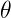
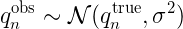

:title: Ace Exam
:author: Bas Rustenburg
:description: Admission to candidacy exam
:keywords: exam, ace, phd
:css: ace.css

.. |prior| image:: images/prior.png

.. |likelihood| image:: images/likelihood.png

.. |Bayes| image:: images/bayes_rule.png

.. |sigma| image:: images/sigma.png

----

:id: titleslide

Admission to candidacy exam
===========================

Bas Rustenburg
--------------

Date : tbd
..........

----

Alchemical free energy calculations
===================================

Alchemical free energy calculations are a powerful computational tool for computing binding free energies, as they allow for efficient sampling of the relevant states of protein-ligand complexes.

.. image:: images/alchem.png
  :width: 700px

www.alchemistry.org

----

Specific aims
=============

In this proposal, we address three of the most significant open challenges
in the quantitative modeling of small molecule recognition by alchemical free energy calculations.

Aims
----

1. Establish a correct quantitative treatment of alchemical free energy calculations for binding of charged ligands.

2. Quantify the magnitude of protonation state effects on binding

3. Develop a framework for alchemical free energy calculations to describe weak association and cooperative ligand binding.

----

Establish a correct quantitative treatment of alchemical free energy calculations for binding of charged ligands
================================================================================================================
Aim 1.
--------

+----------------------------------------+------------------------------------------------------------------------------------------------------------------------------------------------------------------------------------------------------------------------------+
| .. image:: images/reif_oostenbrink.png | In order to apply alchemical free energy calculations to charged ligands, one needs to eliminate artifacts introduced into the calculation arising from the modeling of bulk solvent behavior using a small periodic system. |
+----------------------------------------+                                                                                                                                                                                                                              |
| Image Source: [#]_                     | Ligand interactions with:                                                                                                                                                                                                    |
|                                        |                                                                                                                                                                                                                              |
|                                        | * solvent (Blue)                                                                                                                                                                                                             |
|                                        | * receptor (Red)                                                                                                                                                                                                             |
|                                        | * self-interaction (Green)                                                                                                                                                                                                   |
+----------------------------------------+------------------------------------------------------------------------------------------------------------------------------------------------------------------------------------------------------------------------------+

.. [#] MM Reif and C Oostenbrink. J Comput Chem 35.3 (Nov. 2013), pp. 227–243

----

Establish a correct quantitative treatment of alchemical free energy calculations for binding of charged ligands
================================================================================================================
Aim 1.
--------

+----------------------------------------+---------------------------------------------------------------------------------------------------------------------------------------------------------------------------------------+
| .. image:: images/reif_oostenbrink.png | Bulk liquids are approximated in simulation, either by using periodic boundary conditions, or an implicit solvent.                                                                    |
|                                        | Often, to further reduce computation cost, we introduce truncated,potentials and non-Coulombic electrostatics (such as particle mesh Ewald,[PME],and reaction field [RF] potentials). |
+----------------------------------------+                                                                                                                                                                                       |
| Image Source: [#]_                     |                                                                                                                                                                                       |
|                                        |                                                                                                                                                                                       |
|                                        |                                                                                                                                                                                       |
|                                        |                                                                                                                                                                                       |
|                                        |                                                                                                                                                                                       |
+----------------------------------------+---------------------------------------------------------------------------------------------------------------------------------------------------------------------------------------+

.. [#] MM Reif and C Oostenbrink. J Comput Chem 35.3 (Nov. 2013), pp. 227–243

----

Establish a correct quantitative treatment of alchemical free energy calculations for binding of charged ligands
================================================================================================================
Aim 1.
------

A number of corrections have been proposed but:
 * They have not been compared to each other
 * Quantitative correctness of these methods has not been established

Sources:
 - MM Reif and C Oostenbrink. J Comput Chem 35.3 (Nov. 2013), pp. 227–243
 - GJ Rocklin et al. J Chem Phys 139.18 (2013), p. 184103.
 - YL Lin et al.  J Chem Theory Comput 10.7 (July 2014), pp. 2690–2709.

----

Establish a correct quantitative treatment of alchemical free energy calculations for binding of charged ligands
================================================================================================================
Aim 1.
------

Subaim 1.1:  Develop an accurate approach to quantifying experimental uncertainty in ITC using Bayesian inference.
..................................................................................................................

Because we need a reliable experimental dataset in order to make a quantitative comparison

Subaim 1.2: Perform a quantitative comparison of suggested correction models to experiments to establish a correct treatment of charged ligands in alchemical free energy calculations.
.......................................................................................................................................................................................

Evaluating the charge corrections, testing an alternative (counter ions), comparing to each other and experiment

----

The host-guest model system
===========================

Aim 1
-----

We will use cucurbit-\[7\]-uril as a model system

+-----------------------------------+------------------------------------+----------------------------------------------------------------------------------+
| .. image:: images/guest11_top.png | .. image:: images/guest11_side.png | The system is useful because:                                                    |
|   :width: 200px                   |   :width: 200px                    |                                                                                  |
|                                   |                                    | * Both guest and hosts are very soluble                                          |
+-----------------------------------+------------------------------------+ * They are small, with few degrees of freedom                                    +
| .. image:: images/Kd_guest2.png                                        | * The affinities are in the range of typical protein-small molecule interactions |
|   :width: 410px                                                        |                                                                                  |
+------------------------------------------------------------------------+----------------------------------------------------------------------------------+

----

Develop an accurate approach to quantifying experimental uncertainty in ITC using Bayesian inference.
=====================================================================================================

Subaim 1.1
----------
The experimental parameters, |theta| , can be estimated using Bayes rule:
|Bayes| , where

  - |posterior| is the posterior distribution. The probability of the parameters given the observed data. *This is what we want to know!*
  - |likelihood| is the likelihood. The probability of the observed data, given a single set of parameters.
  - |prior| are distributions containing prior information. We can use this to propagate errors.

We can sample from the posterior distribution by using a technique called *Markov chain Monte Carlo*.

----

Bayes rule in effect
====================

We apply |Bayes| for a value centered around zero,
with prior information that it is between -1 and 1, uniformly distributed.

.. figure:: images/bayes_dist.png

----

Sampling from a posterior distribution using MCMC
=================================================

Flipping an weighted coin

.. figure:: images/distributions.png

  http://bayesianbiologist.com

----

Develop an accurate approach to quantifying experimental uncertainty in ITC using Bayesian inference.
=====================================================================================================

Subaim 1.1
----------

The ITC model structure
.......................

  
Thermodynamic parameters include
  
  - binding affinity, |dG|
  - enthalpy of binding, |dH|
  - mechanical heats offset, |H0|
  - concentration of syringe component, |Xs|
  - concentration of cell component, |Mc|
  - noise parameter, |sigma|

We can use prior distributions |prior| to propagate error estimates in concentrations, and include previous measurements.

----

Develop an accurate approach to quantifying experimental uncertainty in ITC using Bayesian inference.
=====================================================================================================

Subaim 1.1
----------

The ITC model structure
.......................

+--------------------------------------------------------------+-----------------------------------------+
| The likelihood model, |likelihood|, is defined as            | .. image:: images/normal.png            |
|                                                              |   :height: 350px                        |
| .. image:: images/model.png                                  |                                         |
+--------------------------------------------------------------+-----------------------------------------+
| Where the observed heats are sampled from a normal distribution |norm|, with a variance of |variance|. |
+--------------------------------------------------------------------------------------------------------+

----

Compare the different charge correction models
==============================================

Subaim 1.2
----------

We will consider these approaches:

* Reif and Oostenbrink use thermodynamic cycles to eliminate individual components
* Rocklin et al. use Poisson-Boltzmann calculations with exact either numerical solutions to quantify the erroneous contributions.
* Lin et al. use potential of mean force (PMF) calculations in a large simulation system, pulling the ligand away from the protein non-alchemically.
* Eliminating a pair of ions, with a net charge of 0.

We will first check if the methods produce the same quantitative estimate.
Next, we will compare to experiment, to see if they produce a quantitatively correct answer.

This is the first comparison of any of these methods on the same system!

----

That's all folks!
=================
